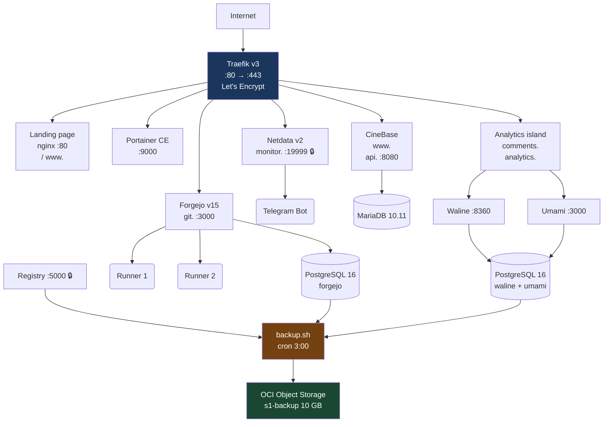

# oracle-servers — Infrastruttura DevOps su OCI ARM64 (Always Free)

Infrastructure-as-Code per trasformare un'istanza OCI Ampere A1 in una piattaforma DevOps completa con reverse proxy HTTPS, registry Docker privato, Git server con CI/CD, monitoring e backup automatico. Tutto orchestrato da script Bash idempotenti e container Docker.

[](https://www.oracle.com/cloud/free/)
[](https://ubuntu.com/)
[](https://www.docker.com/)
[](https://traefik.io/)
[](https://forgejo.org/)
[](https://www.netdata.cloud/)
[](https://dotnet.microsoft.com/)
[-0091BD)](https://www.arm.com/)
[](LICENSE)

[Panoramica](#panoramica) · [Architettura](#architettura) · [Servizi](#servizi-attivi) · [Script](#script-di-setup) · [Guide](#documentazione) · [Avvio Rapido](#avvio-rapido) · [Struttura](#struttura-del-repository) · [CI/CD](#cicd-con-forgejo-actions) · [License](#license)

---

## Panoramica

Questo repository contiene tutto il necessario per ricostruire da zero un server DevOps su OCI ARM64 (Ampere A1, Always Free). Dopo l'esecuzione degli script, il server ospita:

- **Reverse proxy** con certificati HTTPS automatici (Traefik + Let's Encrypt)
- **Docker Registry** privato con autenticazione
- **Git server** con CI/CD integrato (Forgejo + 2 runner ARM64)
- **Monitoring** real-time con allarmi e notifiche Telegram (Netdata v2)
- **Piattaforma applicativa** pronta per ospitare progetti (CineBase già in produzione)
- **Backup automatico** su OCI Object Storage

Tutto su **risorse Always Free** (4 OCPU, 24 GB RAM, ARM Ampere A1, ~100 GB boot volume).

### Perché esiste

Configurare manualmente un server con reverse proxy, certificati, registry, Git, CI/CD e monitoring richiede ore di lavoro manuale soggetto a errori. Questo repository automatizza l'intero processo con script Bash testati, documentati in italiano, con pattern di idempotenza e gestione centralizzata delle variabili d'ambiente.

### Cosa lo rende diverso

- **ARM64 nativo**: tutte le immagini Docker pinnate sono multi-arch, testate su Ampere A1
- **Script idempotenti**: ogni script può essere eseguito N volte senza rompere nulla
- **Nessun segreto hardcodato**: tutte le credenziali in `.env` (gitignorato), template in `.env.example`
- **Documentazione in italiano**: ogni script è commentato, ogni concetto è spiegato
- **Pattern testati in produzione**: Traefik con file provider per basic auth, Docker network a due livelli, runner CI/CD con automount

---

## Architettura



### Stack tecnologico

| Layer | Tecnologia | Versione |
|---|---|---|
| Cloud | OCI Always Free ARM64 | Ampere A1, 4 OCPU, 24 GB RAM |
| OS | Ubuntu Server | 24.04.4 LTS |
| Container Runtime | Docker Engine | 28+ |
| Reverse Proxy | Traefik | 3.7.4 |
| Containers UI | Portainer CE | 2.39.3-alpine |
| Registry | Docker Registry | 3.1.1 |
| Git Server | Forgejo | 15 |
| CI/CD Runners | Forgejo Runner | 12 |
| Database | PostgreSQL 16 + MariaDB 10.11 | - |
| Monitoring | Netdata | v2 stable |
| Notifiche | Telegram Bot API | - |
| Backup | OCI CLI (snap) | - |
| Application | CineBase (.NET 10) | [github.com/malafronte/cinebase](https://github.com/malafronte/cinebase) |
| Comment System | Waline (PostgreSQL) | [waline.js.org](https://waline.js.org) |
| Web Analytics | Umami (PostgreSQL) | [umami.is](https://umami.is) |
| Landing | Nginx | `malafronte.eu` welcome page |

---

## Servizi attivi

| Dominio | Servizio | Container | Porta | Accesso |
|---|---|---|---|---|
| `traefik.<DOMINIO>` | Dashboard Traefik | `traefik` | 80/443 | 🔒 Basic auth |
| `portainer.<DOMINIO>` | Portainer | `portainer` | 9000 | 🔒 Login Portainer |
| `registry.<DOMINIO>` | Docker Registry | `registry` | 5000 | 🔒 `docker login` |
| `registry-ui.<DOMINIO>` | Registry UI | `registry-ui` | 80 | 🔒 Basic auth |
| `git.<DOMINIO>` | Forgejo | `forgejo` | 3000 | Pubblico (registrazione disabilitata) |
| `monitor.<DOMINIO>` | Netdata | `netdata` | 19999 | 🔒 Basic auth |
| `www.<DOMINIO_APP>` | CineBase Frontend | `cinebase-web` | 8080 | Pubblico |
| `api.<DOMINIO_APP>` | CineBase API | `cinebase-filmapi` | 8080 | Pubblico (health check) |
| `comments.<SITO_WEB>` | Waline (commenti) | `analytics-waline` | 8360 | Pubblico (login obbligatorio) |
| `analytics.<SITO_WEB>` | Umami (analytics) | `analytics-umami` | 3000 | 🔒 Login admin |
| `<DOMINIO>` | Landing page | `landing` | 80 | Pubblico |
| `www.<DOMINIO>` | Redirect → `<DOMINIO>` | `landing` | 80 | Pubblico (301) |

---

## Script di setup

Gli script vanno eseguiti in ordine. Ogni script è **idempotente** (puoi rieseguirlo N volte) e carica le variabili da `.env`.

| # | Script | Cosa fa | Prerequisiti |
|---|---|---|---|
| 01 | `01-prerequisiti.sh` | Pacchetti di sistema (ca-certificates, curl, apache2-utils, jq) | Nessuno |
| 02 | `02-installa-docker.sh` | Docker Engine + Compose plugin su ARM64 | 01 |
| 03 | `03-crea-struttura.sh` | Directory `~/docker/` e sottocartelle | 01 |
| 04 | `04-setup-traefik.sh` | Traefik con Let's Encrypt, dashboard protetta, file provider | 02, 03 |
| 05 | `05-setup-portainer.sh` | Portainer CE per gestione container | 04 |
| 06 | `06-setup-registry.sh` | Docker Registry privato con htpasswd | 04 |
| 06b | `06b-setup-registry-ui.sh` | Registry UI con autenticazione condivisa | 06 |
| 07 | `07-setup-forgejo.sh` | Forgejo + PostgreSQL 16 + 2 runner | 04 |
| 07b | `07b-setup-forgejo-runners.sh` | Registrazione e avvio runner CI/CD | 07 |
| 08 | `08-setup-netdata.sh` | Netdata v2 + allarmi + Telegram + check backup | 04 |
| 09 | `09-setup-cinebase.sh` | Stack CineBase (primo deploy) | 04, 06, 07 |
| 10 | `10-setup-backup.sh` | Backup automatico su OCI Object Storage | OCI CLI |
| 11 | `11-setup-analytics.sh` | Waline + Umami + PostgreSQL (commenti e analytics) | 04 |
| 12 | `12-setup-landing.sh` | Landing page malafronte.eu con redirect www | 04 |

### Come eseguire uno script

```bash
# Copia .env.example in .env e compila con i valori reali
cp tenant/servers/s1/.env.example tenant/servers/s1/.env
nano tenant/servers/s1/.env

# Copia sul server ed esegui
scp -i ${S1_SSH_KEY} tenant/servers/s1/scripts/08-setup-netdata.sh ${S1_SSH_USER}@${S1_IP}:~/scripts/
ssh -i ${S1_SSH_KEY} ${S1_SSH_USER}@${S1_IP} "bash ~/scripts/08-setup-netdata.sh"
```

### Come registrare un nuovo runner su Forgejo

```bash
# Genera un secret da 40 caratteri hex
SECRET=$(openssl rand -hex 20)

# Registra il runner (da dentro il container Forgejo)
UUID=$(docker exec -u 1000:1000 forgejo forgejo forgejo-cli actions register \
  --name runner1 \
  --secret "$SECRET")

# UUID e token vanno in runner-config.yml
echo "UUID: $UUID  Secret: $SECRET"
```

---

## Documentazione

| Guida | Descrizione |
|---|---|
| [`guida-server-completo.md`](tenant/docs/guida-server-completo.md) | Guida operativa completa: tutti i servizi, configurazione, comandi |
| [`guida-traefik-completa.md`](tenant/docs/guida-traefik-completa.md) | Traefik dalla A alla Z: router, services, middlewares, certs, basic auth |
| [`guida-cicd-forgejo-actions.md`](tenant/docs/guida-cicd-forgejo-actions.md) | CI/CD con Forgejo Actions: runner, workflow, secrets, errori, fix |
| [`guida-primo-deploy-cinebase.md`](tenant/docs/guida-primo-deploy-cinebase.md) | Primo deploy CineBase: merge .env, build manuale, fix post-avvio |
| [`guida-deploy-waline-umami.md`](tenant/docs/guida-deploy-waline-umami.md) | Deploy Waline + Umami + PostgreSQL: DNS, script, post-deploy, backup |
| [`guida-telegram-bot.md`](tenant/docs/guida-telegram-bot.md) | Bot Telegram: creazione, curl, emoji, Netdata, check-backup |
| [`lessons-learned.md`](tenant/docs/lessons-learned.md) | Lezioni apprese: cosa rifarei diversamente se ricominciassi da zero |
| [`oci-always-free-risorse.md`](tenant/docs/oci-always-free-risorse.md) | Risorse OCI Always Free: limiti, quote, strategia |
| [`sicurezza-oci-firewall.md`](tenant/docs/sicurezza-oci-firewall.md) | Firewall OCI: security list, porte, regole |
| [`rotazione-chiavi-ssh.md`](tenant/docs/rotazione-chiavi-ssh.md) | Rotazione chiavi SSH |
| [`rotazione-chiavi-oci-cli.md`](tenant/docs/rotazione-chiavi-oci-cli.md) | Rotazione chiavi API OCI |

---

## Struttura del repository

```
.
├── tenant/
│   ├── .secrets/                       # 🔒 Gitignorato — chiavi SSH, API key OCI
│   │   ├── s1/
│   │   │   ├── oci-s1-ed25519          # Chiave privata SSH (con passphrase)
│   │   │   ├── oci-s1-deploy-ed25519   # Chiave deploy CI/CD (senza passphrase)
│   │   │   └── oci-s1-ed25519.pub
│   │   └── oci-cli/
│   │       └── oci_api_key.pem         # Chiave API OCI
│   │
│   ├── docs/                           # 📚 Documentazione
│   │   ├── guida-server-completo.md
│   │   ├── guida-traefik-completa.md
│   │   ├── guida-cicd-forgejo-actions.md
│   │   ├── guida-primo-deploy-cinebase.md
│   │   ├── guida-telegram-bot.md
│   │   ├── lessons-learned.md
│   │   ├── analisi-preliminare-server-lab/
│   │   └── ...
│   │
│   └── servers/s1/                     # 🖥️ Configurazione server s1
│       ├── .env                        # 🔒 Gitignorato — variabili reali
│       ├── .env.example                # Template con placeholder
│       ├── scripts/                    # 🔧 Script di setup (01-12)
│       │   ├── 01-prerequisiti.sh
│       │   ├── 02-installa-docker.sh
│       │   ├── ...
│       │   ├── 09-setup-cinebase.sh
│       │   ├── 11-setup-analytics.sh
│       │   └── 12-setup-landing.sh
│       ├── analytics/                   # Template .env per Waline + Umami
│       │   └── .env.example
│       ├── cinebase/                   # Template .env per CineBase
│       │   └── .env.example
│       └── oci-setup/                  # Configurazione OCI (bucket, IAM)
│           └── README.md
│
├── .gitignore
├── LICENSE                             # MIT License
└── README.md
```

### Cosa è gitignorato

```gitignore
**/.secrets/        # Chiavi SSH, chiavi API OCI
.env                # Password, token, OCID reali
*.key, *.pem        # Chiavi private
id_*                # Chiavi SSH
*.log, *.tmp        # Log temporanei
**/data/, **/lib/   # Volumi Docker
```

`.env.example` è **versionato** ma contiene solo placeholder. I valori reali sono in `.env` (gitignorato) e nei secrets Forgejo.

---

## CI/CD con Forgejo Actions

Il server esegue una pipeline CI/CD completa per il progetto CineBase:

```
git push forgejo main
        │
        ▼
Forgejo (git.<DOMINIO>)
        │
        ▼
Runner ARM64 su s1
    ├── Checkout
    ├── Install Docker CLI + SSH client
    ├── Login registry.<DOMINIO>
    ├── docker build (3 immagini .NET 10)
    ├── docker push
    └── Deploy via SSH → docker compose up -d
```

### Secrets richiesti su Forgejo

| Secret | Descrizione |
|---|---|
| `REGISTRY_USER` | Utente del registry privato |
| `REGISTRY_PASSWORD` | Password del registry |
| `S1_SSH_HOST` | IP del server |
| `S1_SSH_USER` | Utente SSH |
| `S1_SSH_KEY` | Chiave privata ed25519 **senza passphrase** |

### Workflow di esempio

```yaml
name: Build and Deploy

on:
  push:
    branches: [main]

jobs:
  build-and-deploy:
    runs-on: ubuntu-latest
    steps:
      - uses: actions/checkout@v4
      - name: Install Docker CLI and SSH client
        run: apt-get update && apt-get install -y docker.io openssh-client
      - name: Login to registry
        run: echo "${{ secrets.REGISTRY_PASSWORD }}" | docker login registry.<DOMINIO> --username "${{ secrets.REGISTRY_USER }}" --password-stdin
      - name: Build and push
        run: |
          docker build -t registry.<DOMINIO>/project/app:latest .
          docker push registry.<DOMINIO>/project/app:latest
      - name: Deploy via SSH
        env:
          SSH_KEY: ${{ secrets.S1_SSH_KEY }}
        run: |
          mkdir -p ~/.ssh && echo "$SSH_KEY" > ~/.ssh/id_ed25519 && chmod 600 ~/.ssh/id_ed25519
          ssh -o StrictHostKeyChecking=no ${{ secrets.S1_SSH_USER }}@${{ secrets.S1_SSH_HOST }} \
            "cd ~/docker/project && docker compose pull && docker compose up -d --remove-orphans"
```

---

## Avvio rapido

### Prerequisiti

- Un'istanza OCI ARM64 Ampere A1 con Ubuntu 24.04
- Un dominio DNS configurato
- Accesso SSH alla VM

### Setup iniziale

```bash
# 1. Clona il repository sul tuo PC
git clone https://github.com/<UTENTE>/oracle-servers.git
cd oracle-servers

# 2. Configura le variabili d'ambiente
cp tenant/servers/s1/.env.example tenant/servers/s1/.env
# Modifica .env con i tuoi valori (dominio, password, OCID)

# 3. Copia gli script sul server
scp -i tua-chiave tenant/servers/s1/scripts/*.sh ubuntu@<IP>:~/scripts/

# 4. Esegui gli script in ordine (01 → 10)
ssh -i tua-chiave ubuntu@<IP> "cd ~/scripts && bash 01-prerequisiti.sh"
ssh -i tua-chiave ubuntu@<IP> "cd ~/scripts && bash 02-installa-docker.sh"
# ... e così via
```

### Aggiungere un nuovo progetto

1. Crea `~/docker/nuovo-progetto/docker-compose.yml` sul server
2. Aggiungi le label Traefik per il dominio
3. Crea record A nel DNS
4. Avvia: `docker compose up -d`

```yaml
# ~/docker/nuovo-progetto/docker-compose.yml
services:
  web:
    image: registry.<DOMINIO>/progetto/app:latest
    networks:
      - internal
      - traefik-net
    labels:
      - "traefik.enable=true"
      - "traefik.http.routers.progetto.rule=Host(`progetto.<DOMINIO>`)"
      - "traefik.http.routers.progetto.entrypoints=websecure"
      - "traefik.http.routers.progetto.tls.certresolver=letsencrypt"
      - "traefik.http.services.progetto.loadbalancer.server.port=3000"

networks:
  internal:
    driver: bridge
  traefik-net:
    external: true
```

---

## Aggiornamento servizi

```bash
# Aggiorna tutte le immagini infrastrutturali
cd ~/docker/traefik && docker compose pull && docker compose up -d
cd ~/docker/registry && docker compose pull && docker compose up -d
cd ~/docker/forgejo && docker compose pull && docker compose up -d
cd ~/docker/netdata && docker compose pull && docker compose up -d

# Deploy di un progetto applicativo
cd ~/docker/cinebase && docker compose pull && docker compose up -d

# Backup manuale
~/docker/backup.sh
```

---

## Monitoraggio

Netdata è accessibile su `https://monitor.<DOMINIO>` (protetto da basic auth).

**Allarmi attivi:**
- CPU > 80% per 10 minuti
- RAM < 10% libera
- Disco > 80% usato (warn) / > 95% (crit)
- Container fermo o servizio down
- Backup > 9 GB (quota OCI 10 GB) → notifica Telegram

**Notifiche Telegram:**
- Alert automatici da Netdata (CPU, RAM, disco, container)
- Alert orario da `check-backup-size.sh` (superamento soglia 9/9.5 GB)

---

## Backup

Backup notturno (cron alle 3:00) su OCI Object Storage:

| Cosa | Perché |
|---|---|
| `postgres/` (database Forgejo) | Repo Git, utenti, issue — non ricostruibili |
| `forgejo/data/` | Allegati, avatar, config |
| `registry/auth/` | Credenziali htpasswd |

**Non backuppato** (ricostruibile):
- `registry/data/` — immagini Docker, rebuildate dal CI/CD
- Configurazioni Traefik — versionate su Forgejo

---

## Relazioni con altri repository

| Repository | Relazione |
|---|---|
| [github.com/malafronte/cinebase](https://github.com/malafronte/cinebase) | Progetto CineBase, deployato su questo server. Contiene il workflow CI/CD (`.forgejo/workflows/deploy.yml`) e la documentazione OCI (`infra/oci/README.md`) |

---

## License

MIT — vedi [LICENSE](LICENSE).

---

*Questo repository è il risultato di un processo iterativo di setup infrastrutturale documentato nelle guide. Se qualcosa non funziona, consulta prima [`lessons-learned.md`](tenant/docs/lessons-learned.md).*
